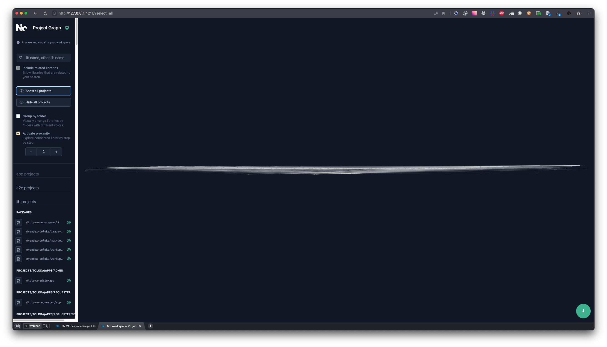

# Monorepo-lens
TODO: add badges

Flexible tool to analyze and visualize dependencies in your monorepo

TODO: add screenshot

## Who is it for?
- You have packages stored in monorepo
- Some packages depends on other ones
- You want to develop, build and test packages faster
- You want to analyze dependencies automatically

## How it works
- **Collectors** - packages, that can collect information about dependencies between packages in monorepo. Monorepo-lens starts from collectors to get infromation about packages and dependencies
- **Lenses** - packages for calculation metrics dependant on packages tree. Monorepo-lens uses it to calculate metrics for each package
- **Reporters** - packages for representing lenses results with different formats. Monorepo-lens runs reporters at the end and pass data from collector and lenses to they

Each of these steps can include multiple packages. For example: 1 collector for lerna, 2 lenses for regression testing cost and library removing progress and 2 reporters for HTML and JSON view.

## How to start
- install monorepo-lens globally `npm i -g monorepo-lens` or to the workspace root
- install necessary collector, lenses and reporters to workspace. We suggest to start with `@monorepo-lens/regress-cost-lens` and `@monorepo-lens/interactive-reporter`
- configure cli using `monorepo-lens configure` from monorepo root
- run it with `npx monorepo-lens run`

## Why not "tool X"
- We tried to use `nx` and lerna@5 with nx visualization. It is not adapted for automatic analyzing and reviewing large monorepos. This is a screenshot of our monorepo visualized with nx. It freezed for a minute and produced a hard-to-read graph

## Configuration
Configuration provided by [cosmiconfig](https://www.npmjs.com/package/cosmiconfig) and can be stored in different formats. `monorepo-lens configure` produces `.repolensrc` file.

Configuration contains 3 sections: collectors, lenses and reporters. Each of this section is object where key is name of package and value is object for this package.

Config for monorepo-lens monorepo you can [find here](./.repolensrc)

## How to develop

Each part of monorepo-lens (collector, lense, reporter) is a simple async function. It takes result of previous part and configuration in arguments and produces result for the next part.

- Create a package with clear name. We suggest to start name with `monorepo-lens` prefix and end with part you want to develop (collector, lense, reporter). For example: `monorepo-lens-god-module-lense`
- Install `@monorepo-lens/schemas` to devDependencies. It will helps with interfaces for your package
- Export default function from main file of this package with right interface:
  - for collector: `import { Collector } from '@monorepo-lens/schemas';`
  - for lense: `import { Lense } from '@monorepo-lens/schemas';`
  - for reporter: `import { Reporter } from '@monorepo-lens/schemas';`
- Implement this interface

### How to develop in this monorepo
- install latest version of pnpm: `npm i -g pnpm`
- install dependencies: `pnpm i`
- start watching for changes in packages: `pnpm -r --parallel --stream watch`
